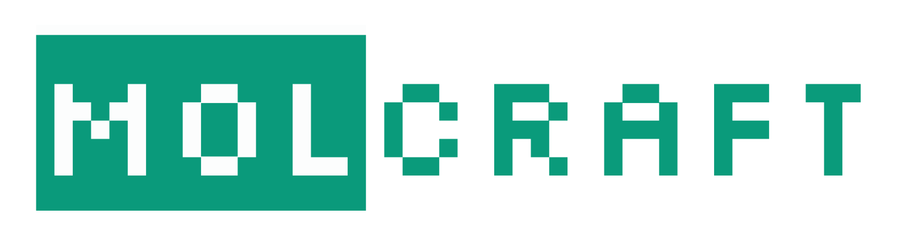

|
| **Deep Learning on Molecules**: A Minimalistic GNN package for Molecular ML. 
|

Highlights
-----------------

- Compatible with **Keras 3**
- Simplified API
- Fast featurization
- Modular graph **layers**
- Serializable graph **featurizers** and **models**
- Flexible **GraphTensor**

------------------------

.. toctree::
  :glob:
  :maxdepth: 1
  :caption: API

  api/*

.. toctree::
  :glob:
  :maxdepth: 1
  :caption: Tutorials

  tutorials/*
